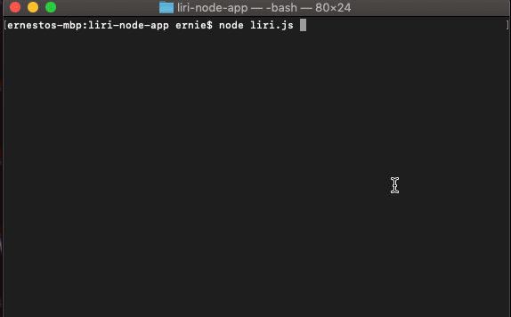
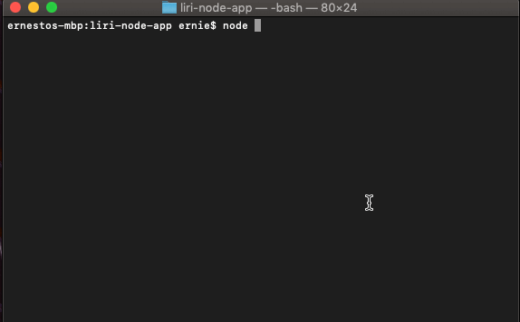
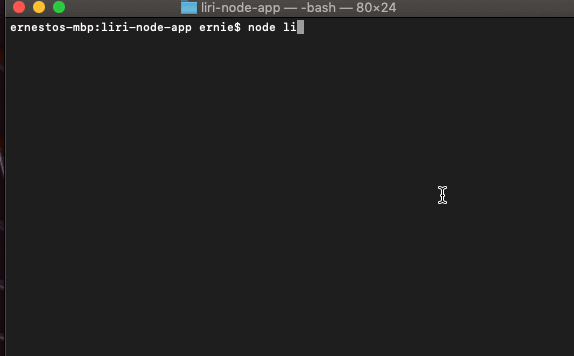
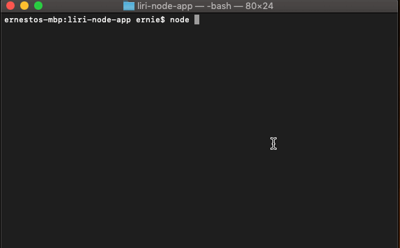

# Liri Bot
Liri Bot will help users find concert, song and movie information. 
## Installation
Will need to run npm installations 
```bash
For Spotify: npm install --save node-spotify-api
axios: npm install axios
```
## Usage
For a concert search: 
```bash
node liri.js concert-this <artist/band name here>
```

For a song search:
```bash
node liri.js spotify-this-song '<song name here>'
```


For a movie search:
```bash
node liri.js movie-this '<movie name here>'
```


For do what is says:
```bash
node liri.js do-what-it-says
```


